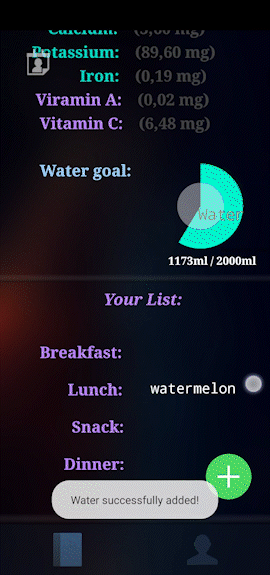
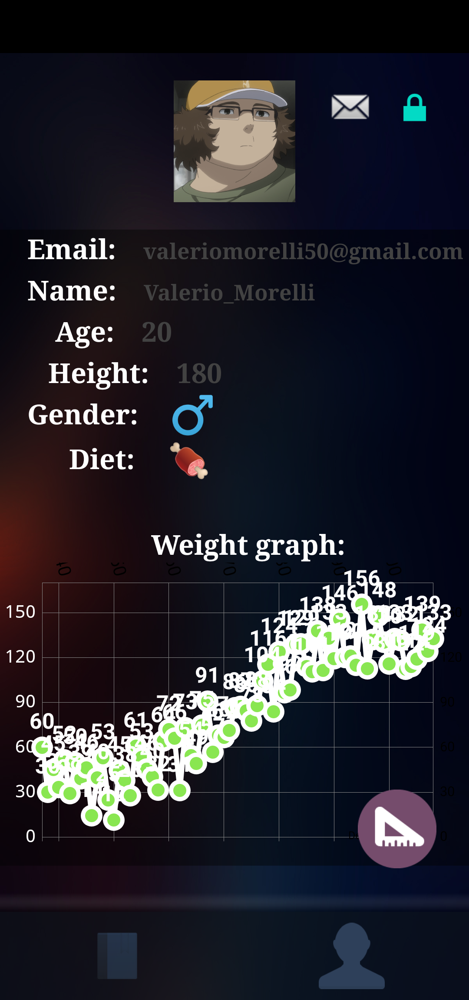
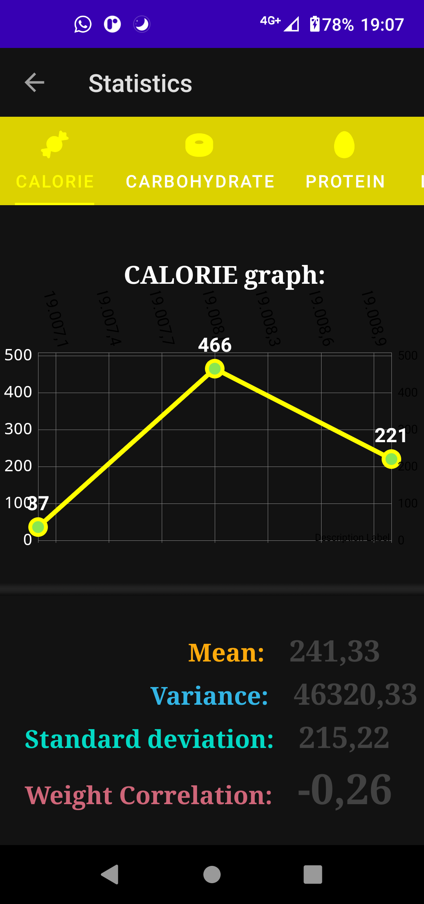
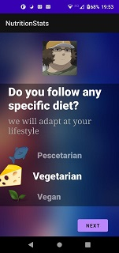
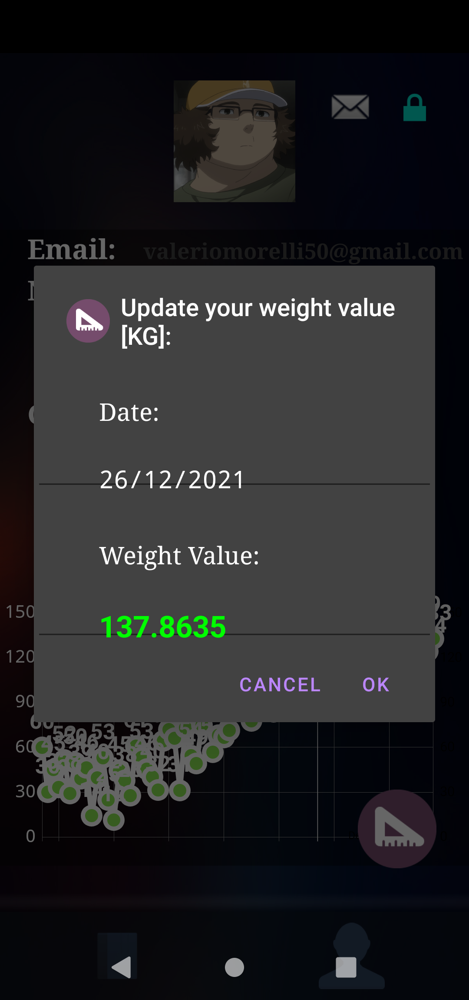
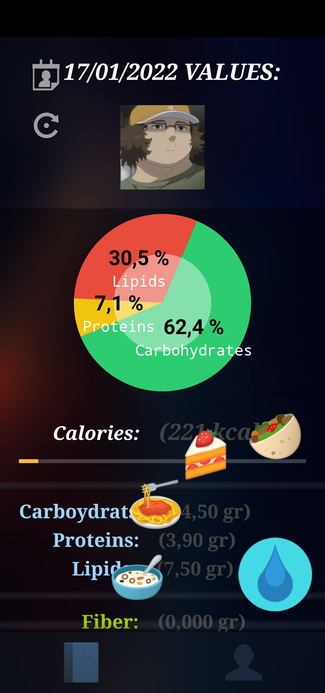
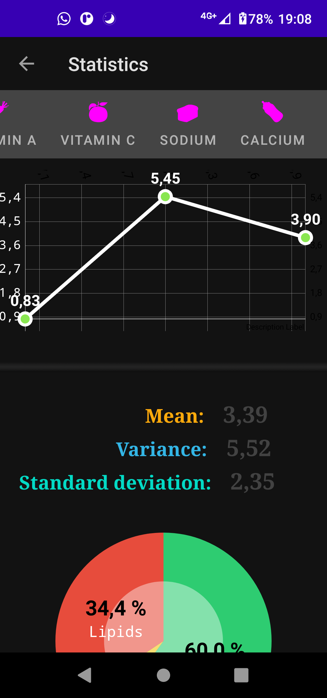
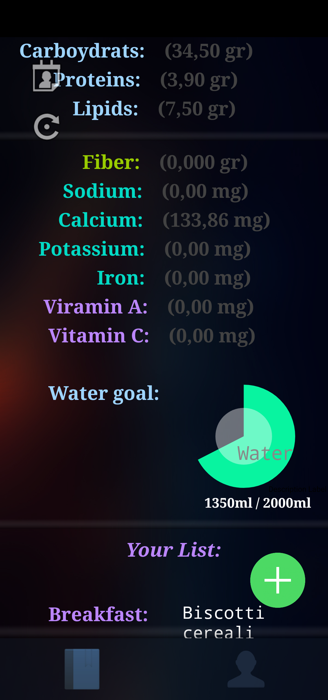
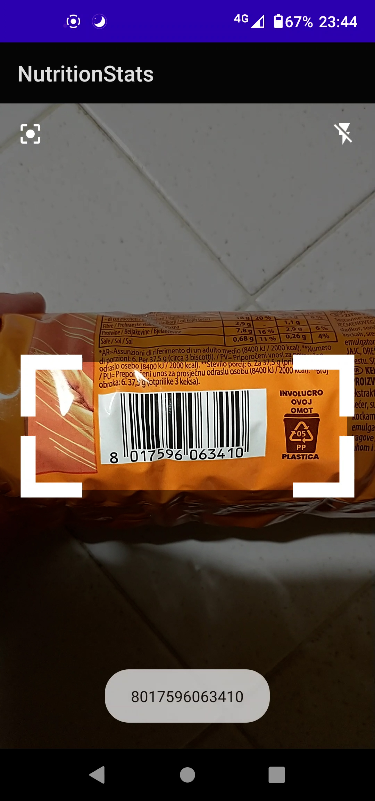

     
# NutritionStats (App)
This is an application using the REST API NutritionStats

### *GooglePlay page*

>You can find this app avaible on GooglePlay store (***now ready***):
>
> *https://play.google.com/store/apps/details?id=it.univpm.nutritionstats*

### *Rest API (server)*

>You can find here the Rest API backend (***REST API***):
>
> *https://github.com/MrPio/ProgettoEsameOOP_Morelli-Mazzatenta*
***
     

     
## *Animations*
### *Access and Statistic*

***
    
### *Add Foods/Water*

***

## *Screenshots*

### *Statistics*

***
     
### *Diary*

     
***
     

## 👥 Author 👥
Name | Email | Github profile |
--|--|--|
Morelli Valerio|valeriomorelli50@gmail.com|[GitHub](https://github.com/MrPio)
